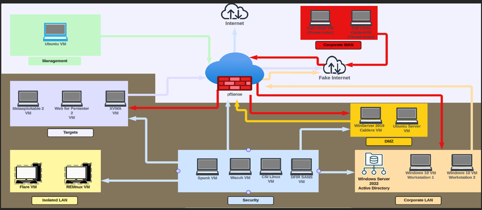

# 🖥️ Cybersecurity HomeLab

## 👋 Introduction
Welcome to my **Cybersecurity HomeLab** project.  
Someone once said, "Practice is infinitely superior to theory." Let's get to work: it's time to research and design my own homelab.
SoBatistaCyber Guide: https://www.youtube.com/watch?v=sC6jEr8ox8g&list=PL_eQ4NSC2HGOrS1bHz4WTJ4Cbc2ie4RgP&index=1

This space documents the process of building and configuring a personal lab environment to simulate a **Security Operations Center (SOC)**.  
The lab is designed for **hands-on learning** in threat detection, incident response, and security tool deployment.

The goal of this HomeLab is to:
- Gain practical experience with SOC workflows
- Practice using **SIEM**, **EDR**, and other security tools
- Simulate real-world attack and defense scenarios

---

## 🏠 Host & Hypervisor Information
Here is the hardware and software setup for the system hosting the virtual environment.

| Component         | Details |
|-------------------|---------|
| **Host Machine**  | MSI GF63 Thin 11SC |
| **CPU**           | 11th Gen Intel(R) Core(TM) i5-11400H @ 2.70GHz (2.69 GHz) |
| **RAM**           | 32.0 GB |
| **Storage**       | 1TB External SSD |
| **OS**            | Windows 11 |
| **Hypervisor**    | VMware Workstation 17 Pro |

---

## ⚙️ Lab Setup & Configuration
This section covers the steps I followed to create and configure my SOC HomeLab environment.  
It will also include **screenshots** for reference.

### **1. Network Topology**
My HomeLab topology consists of seven VLANs, which are detailed in the following diagram (with actual and future VMs):

- VLAN1 hosts an Ubuntu VM that will be used to access and manage the firewall via its GUI.
- VLAN10 hosts two VMs (Kali Linux - Kali Linux Caldera). The idea is to simulate External Threat Actors.
- VLAN20 

*(Insert diagram here — can be created using draw.io, Lucidchart, or even a hand-drawn scan)*

### **2. Virtual Machines**
- **SIEM Server:** (e.g., LimaCharlie, Wazuh, or Splunk)
- **Attack Simulation:** (e.g., Kali Linux, Sliver C2)
- **Windows Endpoint:** Simulates user workstation
- **Linux Server:** Hosting internal services

### **3. Tools Used**
- [Splunk](https://www.splunk.com/) – Log analysis & SIEM
- [Wazuh](https://wazuh.com/) – Open-source SIEM & XDR
- [Security Onion](https://securityonion.net/) – Network monitoring
- [Kali Linux](https://www.kali.org/) – Penetration testing

### **4. Screenshots**
*(Screenshots will be added after setup completion — examples could be VM dashboard, SIEM interface, detection alerts, etc.)*

---

## 📜 Future Plans
- Install Wazuh
- Rotate VMs included in the Target VLAN
- Expand lab to include Splunk

---

