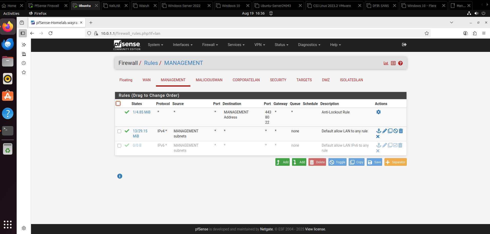
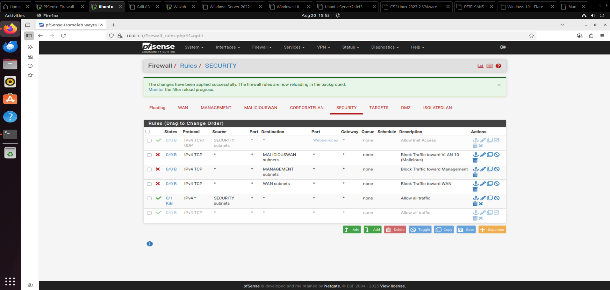
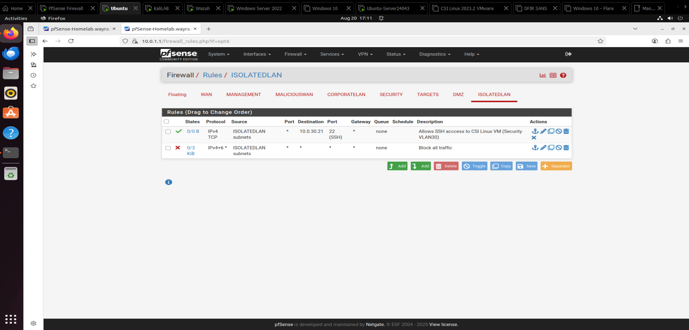

# 🖥️ Cybersecurity HomeLab

## 👋 Introduction
Welcome to my **Cybersecurity HomeLab** project.  
Someone once said, "Practice is infinitely superior to theory." Let's get to work; it's time to research and design my own homelab.

This space documents the process of building and configuring a personal lab environment to simulate a **Security Operations Center (SOC)**.  
The lab is designed for **hands-on learning** in threat detection, incident response, and security tool deployment.

The goal of this HomeLab is to:
- Gain practical experience with SOC workflows
- Practice using **SIEM**, **EDR**, and other security tools
- Simulate real-world attack and defense scenarios

SoBatistaCyber Guide: https://www.youtube.com/watch?v=sC6jEr8ox8g&list=PL_eQ4NSC2HGOrS1bHz4WTJ4Cbc2ie4RgP&index=1

David Varghese Blog: https://blog.davidvarghese.net/posts/building-home-lab-part-1/

---

## 🏠 Host & Hypervisor Information
Here is the hardware and software setup for the system hosting the virtual environment.

| Component         | Details |
|-------------------|---------|
| **Host Machine**  | MSI GF63 Thin 11SC |
| **CPU**           | 11th Gen Intel(R) Core(TM) i5-11400H @ 2.70GHz (2.69 GHz) |
| **RAM**           | 32.0 GB |
| **Storage**       | 1TB External SSD |
| **OS**            | Windows 11 |
| **Hypervisor**    | VMware Workstation 17 Pro |

---

## ⚙️ Lab Setup & Configuration
This section covers the steps I followed to create and configure my SOC HomeLab environment. It will also include **screenshots** for reference.

### **1. Network Topology**
My HomeLab network topology consists of seven VLANs, which are detailed in the following diagram (with actual and future VMs):

- VLAN1 (Management - 10.0.1.0/24) hosts an Ubuntu VM that will be used to access and manage the firewall via its GUI.
- VLAN10 (Malicious WAN - 10.0.10.0/24) hosts two VMs (Kali Linux - Kali Linux Caldera). The idea is to simulate External Threat Actors.
- VLAN20 (Corporate LAN - 10.0.20.0/24) hosts three VMs (Win Server 2022 and two Win 10) simulating a Corporate LAN.
- VLAN30 (Security LAN - 10.0.30.0/24) hosts Splunk, Wazuh, CSI Linux, and DFIR SANS for centralized security monitoring, analysis, and incident response in a controlled lab environment.
- VLAN40 (Targets - 10.0.40.0/24) contains Metasploitable 2, Web for Pentester, and XVWA as vulnerable systems for penetration testing and exploit development.
- VLAN50 (DMZ - 10.0.50.0/24)  runs Ubuntu Server to simulate public-facing services and test security controls in a demilitarized zone setup.
- VLAN99 (Isolated LAN - 10.0.99.0/24) hosts FLARE and REMnux for safe malware analysis and reverse engineering in a fully isolated network.
 
  
**WMware Virtual Network Configuration:**

 

### **2. Virtual Machines**
In this section, I’m listing all the virtual machines I set up for my HomeLab. Each one has a specific job, like managing the network, monitoring security events, or simulating attacks. Although the links provided above focus on deployment using VirtualBox, I prefer VMware Workstation for its better features, including higher performance and reliability.

 
 

<b># pfSense Firewall #</b>

This VM is equipped with WAN, LAN, and multiple VLAN interfaces for segmented network security. Perfect for messing around with firewalls, spotting intrusions, and keeping stuff isolated. Further configurations such as interface names, rules, and other settings are managed through a web browser on an Ubuntu Machine, which is used to oversee the pfSense firewall.

 

<b># Ubuntu Management #</b>

The Ubuntu VM (Management) serves as the central control hub for managing the pfSense firewall.

pfSense dashboard displaying the firewall status, system info, firewall logs and interfaces details.

 

**Firewall Rules:**  
 
The Management interface allows secure admin access to the pfSense firewall via HTTPS, HTTP, or SSH. Outbound traffic from the Management VLAN is unrestricted for updates and monitoring. Access from other VLANs is blocked by default, isolating the Ubuntu Management VM and firewall management plane for security.

The MaliciousWAN interface controls traffic to and from potential untrusted sources. Rules allow connections to the Internet and permit communication to internal VLANs (Corporate, Targets, and DMZ subnets). Traffic between hosts within the subnet is allowed.

The CORPORATELAN interface manages traffic to and from the organization’s trusted internal corporate network. Rules permit communications to internal VLANs (Security and pretending "External Malicious" subnets) and access to the Internet is disable. Traffic between hosts within the subnet is allowed.

The SECURITY interface rules restrict traffic by blocking communications to the Malicious WAN, Management, and WAN subnets. Access to specific web services is permitted only when enabled for updates. Traffic from the SECURITY subnet to other internal subnets is allowed.

The TARGETS interface rules permit traffic within internal VLANs (VLAN 10, 30, and 40). Access to specific web services is permitted only when enabled for updates. Traffic between hosts within the subnet is allowed.

The DMZ interface rules allow Internet access and communication with VLAN10 (MaliciousWAN), VLAN30 (Security), and intra-VLAN50 traffic.

The IsolatedLAN allows only SSH access to the CSI Linux VM (10.0.30.21) in the Security subnet for controlled file transfers and forensic analysis. All other inbound and outbound traffic from the isolated environment is strictly blocked to maintain containment.

In the homelab, network segmentation creates a controlled setup by separating traffic and applying rules to each VLAN. This improves security, lowers risks of attacks, and makes testing and analysis safer and more reliable.

 
 

<b># KaliLAB #</b>

The KaliLAB VM is placed in the Malicious WAN to simulate an external attacker. It represents threat actors attempting to exploit vulnerabilities and compromise systems in other VLANs, such as the Corporate, Targets or DMZ. Besides malicious activities, it is also used for vulnerability assessments and penetration testing.

 
 

<b># Kali - Caldera #</b>

The Kali Caldera VM, running in the Malicious WAN, emulates adversary behavior using automated attack frameworks. It represents threat actors performing persistence, privilege escalation, and lateral movement against systems in other VLANs. This VM provides controlled red-team style testing to evaluate how the lab environment detects and responds to real-world threats.

 
 
- **SIEM Server:** 
- **Attack Simulation:** 
- **Windows Endpoint:** Simulates user workstation
- **Linux Server:** Hosting internal services

### **4. Upgrades**
*(Screenshots will be added after setup completion — VM dashboard, SIEM interface, detection alerts, etc.)*

---

## 📜 Future Plans
- Install Wazuh
- Rotate VMs included in the Target VLAN
- Expand lab to include Splunk

---

