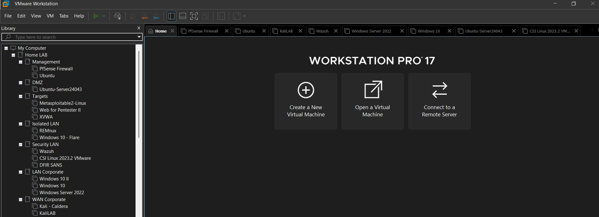

# 🖥️ Cybersecurity HomeLab

## 👋 Introduction
Welcome to my **Cybersecurity HomeLab** project.  
Someone once said, "Practice is infinitely superior to theory." Let's get to work: it's time to research and design my own homelab.
SoBatistaCyber Guide: https://www.youtube.com/watch?v=sC6jEr8ox8g&list=PL_eQ4NSC2HGOrS1bHz4WTJ4Cbc2ie4RgP&index=1

This space documents the process of building and configuring a personal lab environment to simulate a **Security Operations Center (SOC)**.  
The lab is designed for **hands-on learning** in threat detection, incident response, and security tool deployment.

The goal of this HomeLab is to:
- Gain practical experience with SOC workflows
- Practice using **SIEM**, **EDR**, and other security tools
- Simulate real-world attack and defense scenarios

---

## 🏠 Host & Hypervisor Information
Here is the hardware and software setup for the system hosting the virtual environment.

| Component         | Details |
|-------------------|---------|
| **Host Machine**  | MSI GF63 Thin 11SC |
| **CPU**           | 11th Gen Intel(R) Core(TM) i5-11400H @ 2.70GHz (2.69 GHz) |
| **RAM**           | 32.0 GB |
| **Storage**       | 1TB External SSD |
| **OS**            | Windows 11 |
| **Hypervisor**    | VMware Workstation 17 Pro |

---

## ⚙️ Lab Setup & Configuration
This section covers the steps I followed to create and configure my SOC HomeLab environment.  
It will also include **screenshots** for reference.

### **1. Network Topology**
My HomeLab network topology consists of seven VLANs, which are detailed in the following diagram (with actual and future VMs):

- VLAN1 (Management - 10.0.1.0/24) hosts an Ubuntu VM that will be used to access and manage the firewall via its GUI.
- VLAN10 (Malicious WAN - 10.0.10.0/24) hosts two VMs (Kali Linux - Kali Linux Caldera). The idea is to simulate External Threat Actors.
- VLAN20 (Corporate LAN - 10.0.20.0/24) hosts three VMs (Win Server 2022 and two Win 10) simulating a Corporate LAN.
- VLAN30 (Security LAN - 10.0.30.0/24) hosts Splunk, Wazuh, CSI Linux, and DFIR SANS for centralized security monitoring, analysis, and incident response in a controlled lab environment.
- VLAN40 (Targets - 10.0.40.0/24) contains Metasploitable 2, Web for Pentester, and XVWA as vulnerable systems for penetration testing and exploit development.
- VLAN50 (DMZ - 10.0.50.0/24)  runs Ubuntu Server to simulate public-facing services and test security controls in a demilitarized zone setup.
- VLAN99 (Isolated LAN - 10.0.99.0/24) hosts FLARE and REMnux for safe malware analysis and reverse engineering in a fully isolated network.

WMware Virtual Network Configuration:

### **2. Virtual Machines**
In this section, I’m listing all the virtual machines I set up for my HomeLab. Each one has a specific job, like managing the network, monitoring security events, or simulating attacks.

- **SIEM Server:** 
- **Attack Simulation:** 
- **Windows Endpoint:** Simulates user workstation
- **Linux Server:** Hosting internal services

### **4. Upgrades**
*(Screenshots will be added after setup completion — VM dashboard, SIEM interface, detection alerts, etc.)*

---

## 📜 Future Plans
- Install Wazuh
- Rotate VMs included in the Target VLAN
- Expand lab to include Splunk

---

